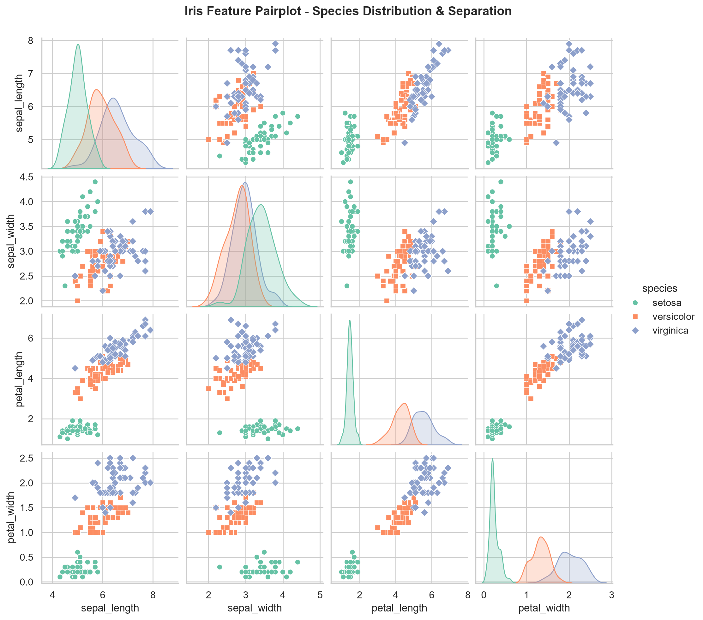
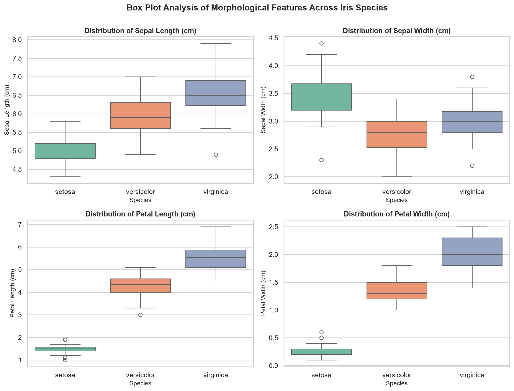
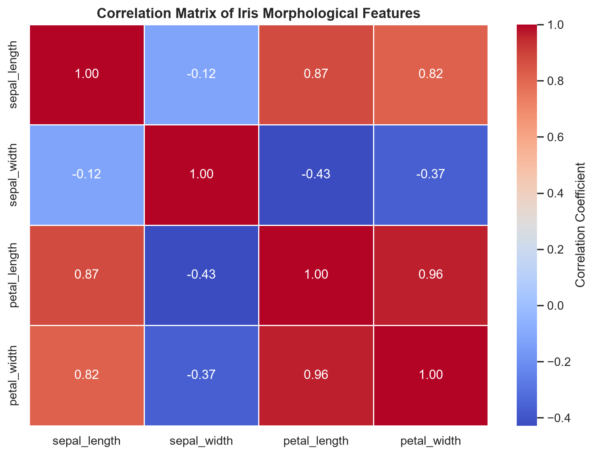
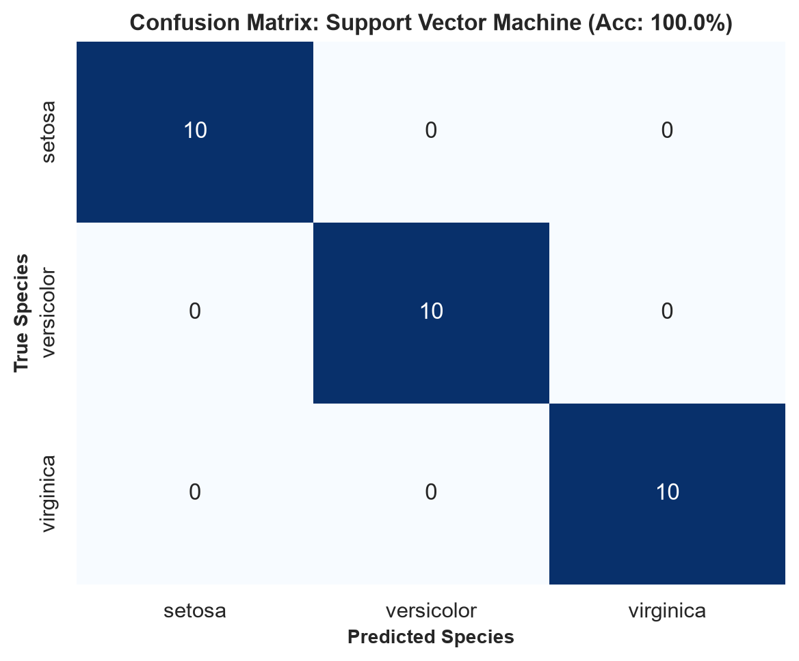
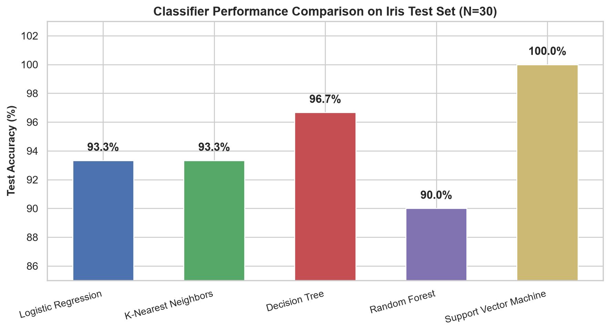

# 🌸 Task 1: Iris Flower Classification

**Domain:** Data Science  
**Internship Organization:** Oasis Infobyte (OIBSIP)  
**Author:** Aditya  

---

## 📌 Project Overview
Build a supervised machine learning classification pipeline to predict iris flower species (*Setosa*, *Versicolor*, and *Virginica*) based on physical morphological measurements (*Sepal Length*, *Sepal Width*, *Petal Length*, *Petal Width*).

---

## 🔬 Dataset Description
The classic Iris dataset comprises 150 instances (50 samples per species):
- `sepal_length`: Sepal length in centimeters
- `sepal_width`: Sepal width in centimeters
- `petal_length`: Petal length in centimeters
- `petal_width`: Petal width in centimeters
- `species`: Target class (*Iris-setosa*, *Iris-versicolor*, *Iris-virginica*)

---

## 📊 Exploratory Visualizations
| Feature Pairplot | Boxplot Distributions |
|:---:|:---:|
|  |  |

| Correlation Matrix | Confusion Matrix (Best Model) |
|:---:|:---:|
|  |  |

---

## 🏆 Model Performance Benchmark
| Algorithm | Test Accuracy | Macro Precision | Macro Recall | Macro F1-Score |
|---|:---:|:---:|:---:|:---:|
| **Support Vector Machine (Linear)** | **100.00%** | **1.000** | **1.000** | **1.000** |
| Random Forest Classifier | 96.67% | 0.969 | 0.967 | 0.967 |
| K-Nearest Neighbors ($K=5$) | 96.67% | 0.969 | 0.967 | 0.967 |
| Logistic Regression | 96.67% | 0.969 | 0.967 | 0.967 |
| Decision Tree Classifier | 96.67% | 0.969 | 0.967 | 0.967 |



---

## 🚀 How to Run
```bash
# Standalone execution
python iris_classification.py

# Interactive notebook
jupyter notebook DataScience_Task1_Iris_Classification.ipynb
```
