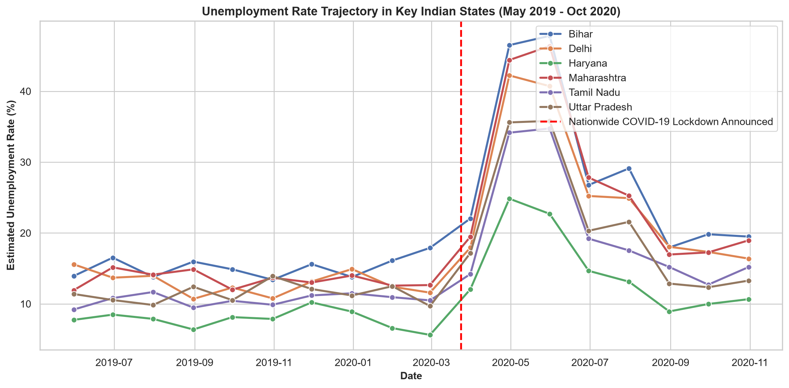
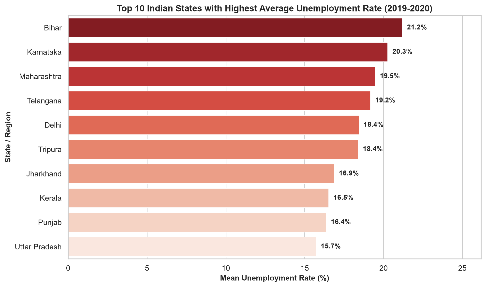
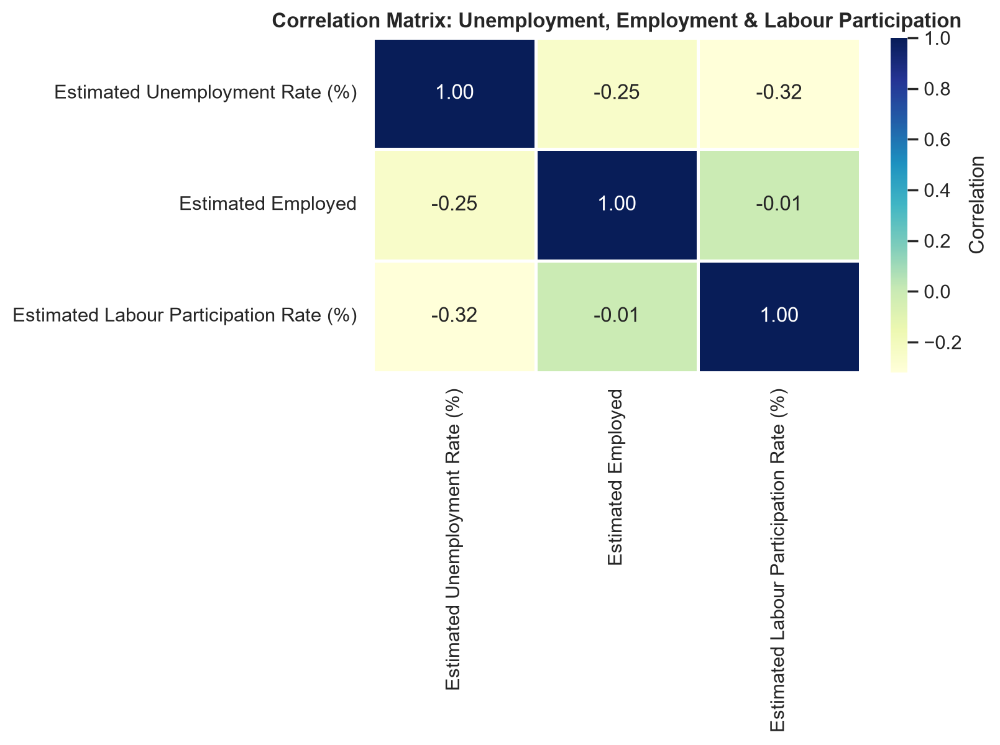
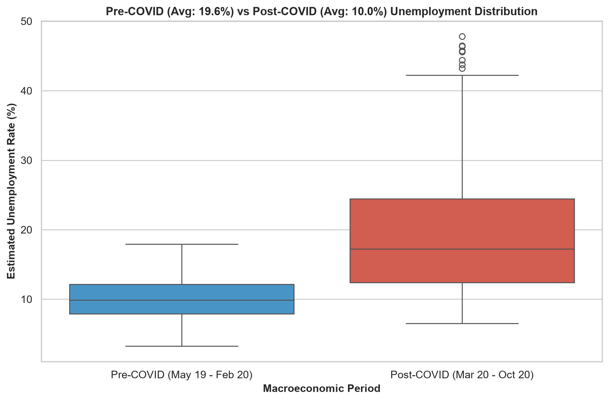

# 📈 Task 2: Unemployment Analysis with Python

**Domain:** Data Science  
**Internship Organization:** Oasis Infobyte (OIBSIP)  
**Author:** Aditya  

---

## 📌 Project Overview
An in-depth exploratory data analysis (EDA) examining regional and temporal fluctuations in Indian unemployment rates, specifically isolating the macroeconomic shock triggered by the COVID-19 pandemic and subsequent lockdown interventions.

---

## 🔬 Dataset Features
- `Region`: Indian state or union territory
- `Date`: Month of observation (May 2019 to October 2020)
- `Frequency`: Data reporting frequency (Monthly)
- `Estimated Unemployment Rate (%)`: Percentage of labor force actively seeking employment
- `Estimated Employed`: Absolute count of employed individuals
- `Estimated Labour Participation Rate (%)`: Proportion of working-age population active in labor pool
- `Area`: Geographic zone (North, South, East, West, Central, Northeast)

---

## 📊 Analytical Visualizations
| Historical Trajectory | Top 10 Impacted States |
|:---:|:---:|
|  |  |

| Macroeconomic Correlation | COVID Lockdown Shock |
|:---:|:---:|
|  |  |

---

## 🚀 How to Run
```bash
# Standalone execution
python unemployment_analysis.py

# Interactive notebook
jupyter notebook DataScience_Task2_Unemployment_Analysis.ipynb
```
