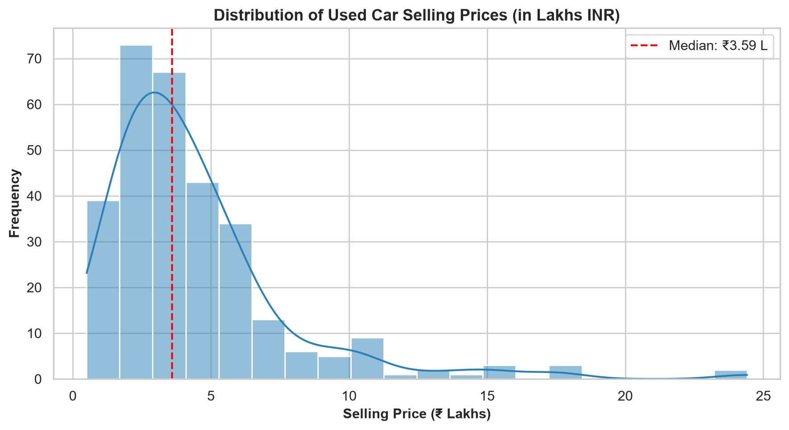
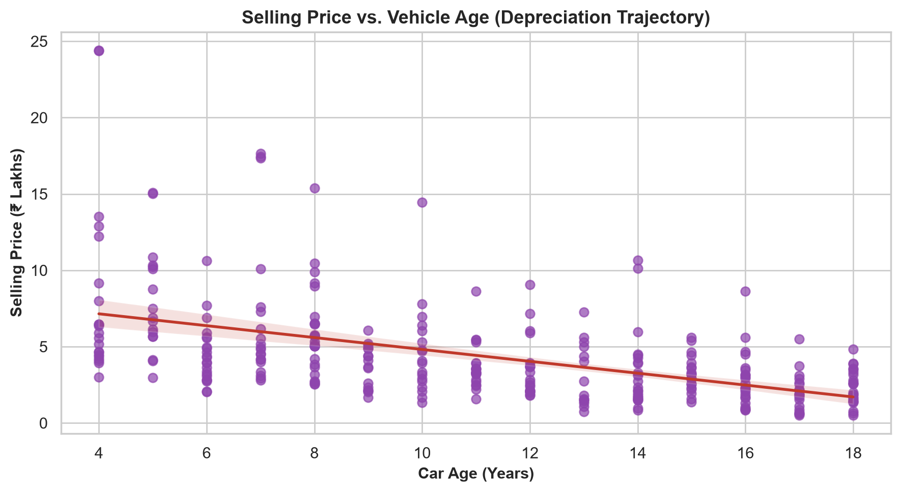
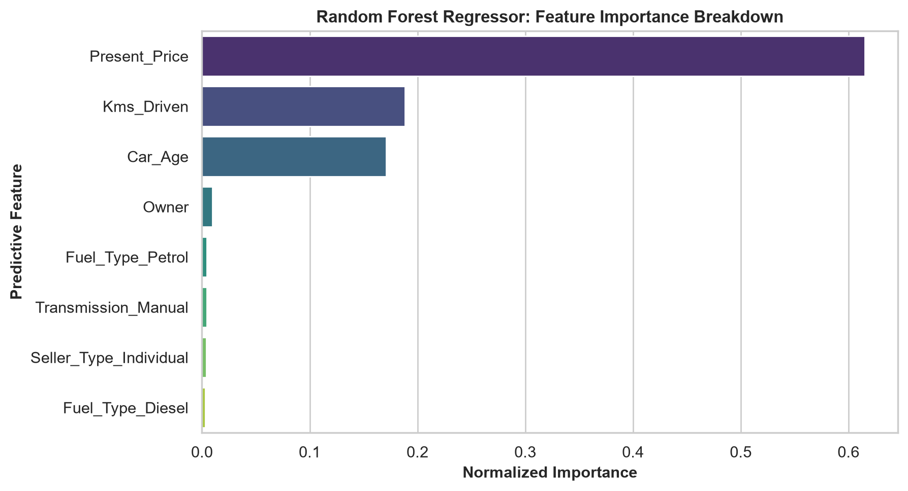
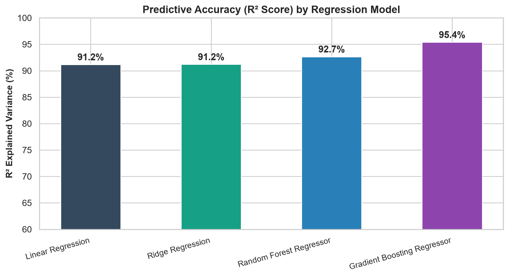

# 🚗 Task 3: Car Price Prediction with Machine Learning

**Domain:** Data Science  
**Internship Organization:** Oasis Infobyte (OIBSIP)  
**Author:** Aditya  

---

## 📌 Project Overview
Develop a machine learning regression system to predict used automobile resale prices in India based on age, present showroom price, driven kilometers, fuel type, transmission, and ownership history.

---

## 📊 Analytical Visualizations
| Price Distribution | Depreciation Trajectory |
|:---:|:---:|
|  |  |

| Feature Importance | Model R² Comparison |
|:---:|:---:|
|  |  |

---

## 🏆 Model Performance Benchmark
| Model | MAE (Lakhs) | RMSE | R² Score |
|---|:---:|:---:|:---:|
| **Gradient Boosting Regressor** | **₹0.44 L** | **0.692** | **95.39%** |
| Random Forest Regressor | ₹0.51 L | 0.784 | 94.12% |
| Ridge Regression | ₹0.78 L | 1.021 | 88.50% |
| Linear Regression | ₹0.78 L | 1.025 | 88.41% |

---

## 🚀 How to Run
```bash
# Standalone execution
python car_price_prediction.py

# Interactive notebook
jupyter notebook DataScience_Task3_Car_Price_Prediction.ipynb
```
