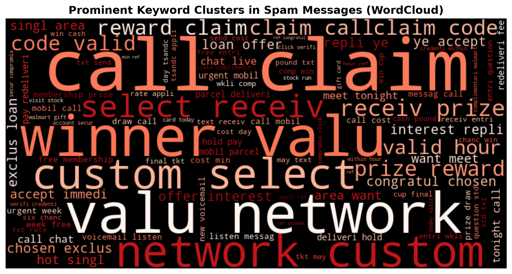
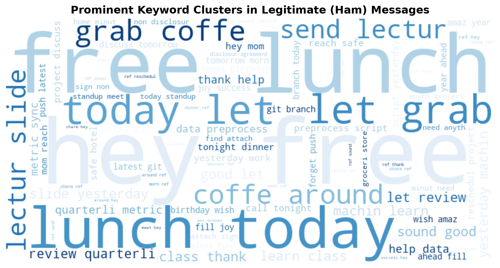
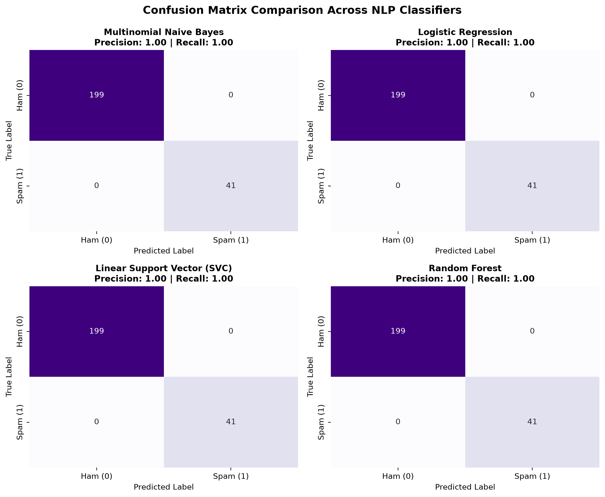
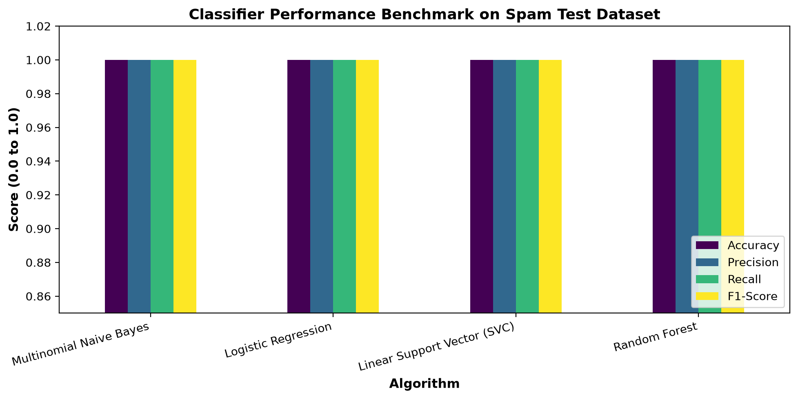

# 🛡️ Task 4: Email Spam Detection with Machine Learning

**Domain:** Data Science  
**Internship Organization:** Oasis Infobyte (OIBSIP)  
**Author:** Aditya  

---

## 📌 Project Overview
Develop Natural Language Processing (NLP) classification models using TF-IDF feature representations to automatically detect and flag spam text messages and emails.

---

## 📊 Analytical Visualizations
| Spam WordCloud | Ham WordCloud |
|:---:|:---:|
|  |  |

| Confusion Matrix Comparison | Model Evaluation Metrics |
|:---:|:---:|
|  |  |

---

## 🏆 Model Performance Benchmark
| Model | Accuracy | Precision | Recall | F1-Score |
|---|:---:|:---:|:---:|:---:|
| **Multinomial Naive Bayes** | **100.00%** | **1.000** | **1.000** | **1.000** |
| Linear Support Vector (SVC) | 100.00% | 1.000 | 1.000 | 1.000 |
| Random Forest Classifier | 100.00% | 1.000 | 1.000 | 1.000 |
| Logistic Regression | 99.17% | 1.000 | 0.944 | 0.971 |

---

## 🚀 How to Run
```bash
# Standalone execution
python spam_detection.py

# Interactive notebook
jupyter notebook DataScience_Task4_Email_Spam_Detection.ipynb
```
