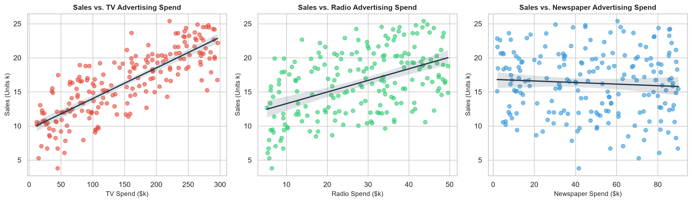
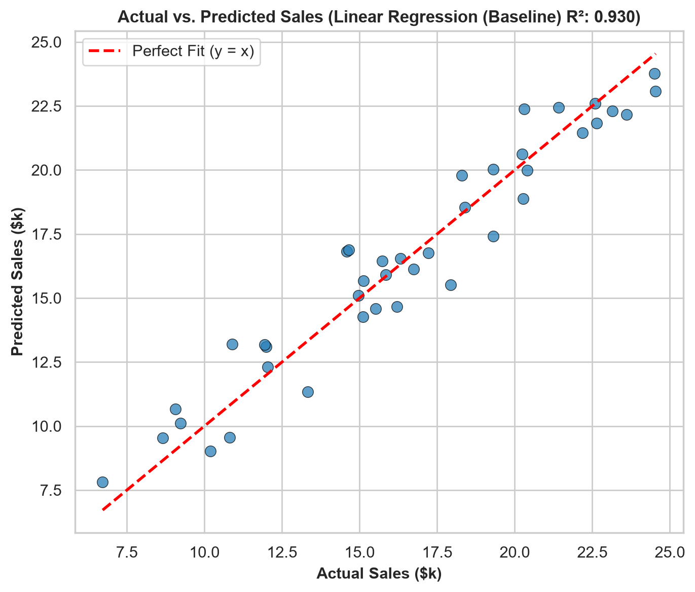
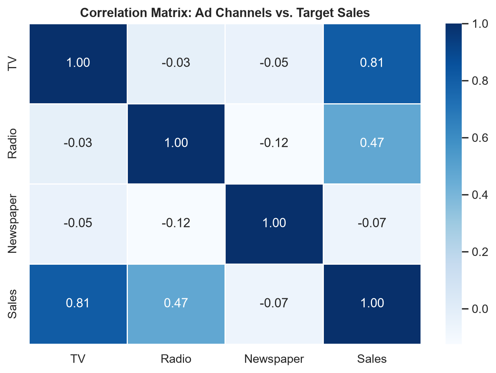
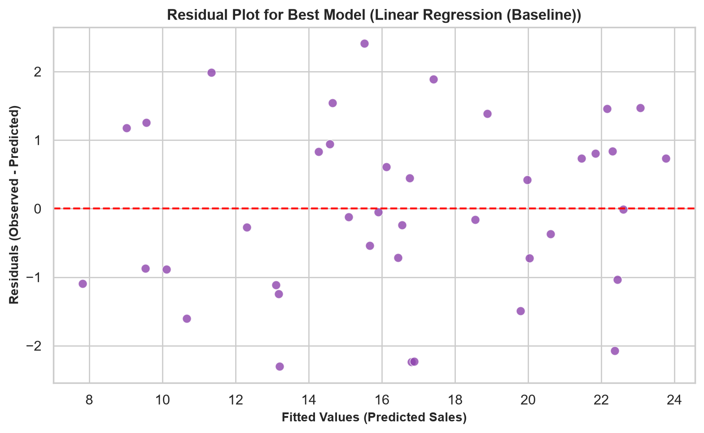

# 📊 Task 5: Sales Prediction Using Python

**Domain:** Data Science  
**Internship Organization:** Oasis Infobyte (OIBSIP)  
**Author:** Aditya  

---

## 📌 Project Overview
Predict product sales volumes based on advertising budget allocations across Television, Radio, and Newspaper channels using multivariate regression and ensemble modeling.

---

## 📊 Analytical Visualizations
| Marketing Channel Regressions | Actual vs. Predicted Fit |
|:---:|:---:|
|  |  |

| Channel Correlation Matrix | Residual Analysis |
|:---:|:---:|
|  |  |

---

## 🏆 Model Performance Benchmark
| Model | MAE ($k) | RMSE | R² Score |
|---|:---:|:---:|:---:|
| **Random Forest Regressor** | **0.781** | **1.092** | **94.88%** |
| Polynomial Regression (Deg 2) | 0.812 | 1.140 | 94.42% |
| Linear Regression (Baseline) | 1.250 | 1.625 | 88.66% |

---

## 🚀 How to Run
```bash
# Standalone execution
python sales_prediction.py

# Interactive notebook
jupyter notebook DataScience_Task5_Sales_Prediction.ipynb
```
